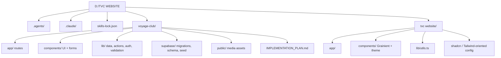
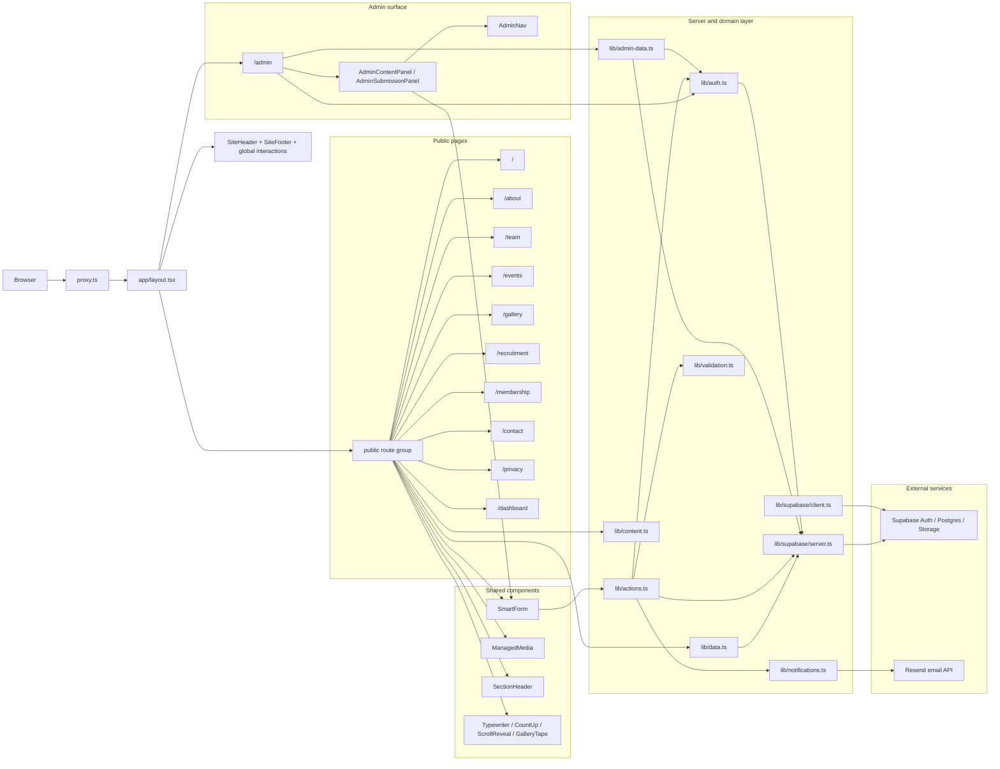
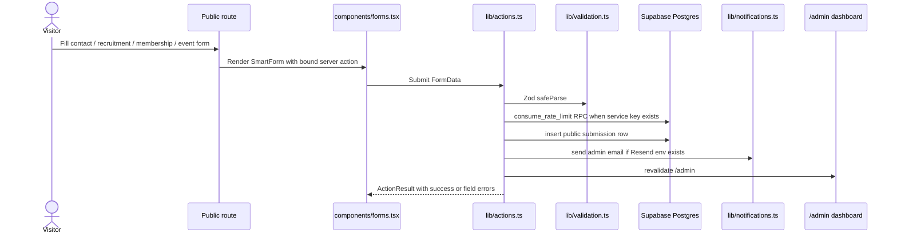
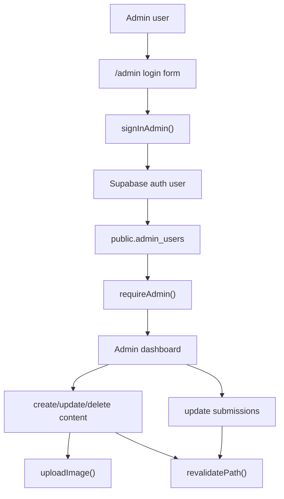
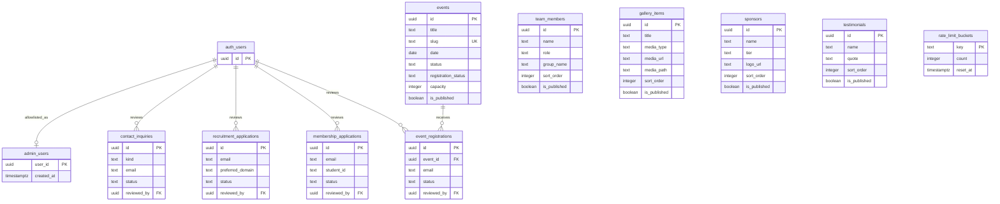

# Project Graph

Generated: July 7, 2026

This is a whole-workspace map for `D:/TVC WEBSITE`. The active production-oriented app is `voyage-club`; `tvc website` is a separate older Next.js template/prototype.

## Workspace Map

## Runtime Architecture

## Public Submission Flow

## Admin Flow

## Database And Storage Graph

Storage bucket:

- `public-site-media`: public read, admin upload/update/delete, 5 MB file limit, image MIME allowlist.

## Import Hubs

| Hub | Role | Main dependents |
| --- | --- | --- |
| `lib/actions.ts` | Server actions for public forms, admin auth, content CRUD, media upload, submission review | public form pages, `components/admin-panel.tsx` |
| `lib/data.ts` | Published content reads with demo fallbacks outside production | home, team, events, gallery |
| `lib/admin-data.ts` | Admin-only reads and counts | `app/admin/page.tsx` |
| `lib/auth.ts` | Current user lookup, admin allowlist checks, required admin guard | admin page, admin data, admin mutations |
| `lib/validation.ts` | Zod schemas for public and admin forms | `lib/actions.ts`, validation tests |
| `lib/supabase/server.ts` | SSR Supabase client and service-role client | data, auth, actions, admin page |
| `components/forms.tsx` | Client SmartForm wrapper for `useActionState` | public forms and admin panels |
| `components/admin-panel.tsx` | Admin CRUD/review UI | `app/admin/page.tsx` |

## Route To Data Map

| Route | Reads | Writes / actions |
| --- | --- | --- |
| `/` | `getEvents`, `getGalleryItems`, `getSponsors`, `getTestimonials`, `lib/content.ts` | none |
| `/about` | mostly static content/media | none |
| `/team` | `getTeamMembers` | none |
| `/events` | `getEvents` | `submitEventRegistration` |
| `/gallery` | `getGalleryItems`, `lib/content.ts` | none |
| `/recruitment` | `lib/content.ts` | `submitRecruitmentApplication` |
| `/membership` | page content | `submitMembershipApplication` |
| `/contact` | `siteConfig` / social config | `submitContactInquiry` |
| `/admin` | `getCurrentUser`, `isCurrentUserAdmin`, `getAdminCounts`, `getAdminContent`, `getAdminSubmissions` | `signInAdmin`, `signOutAdmin`, `createContent`, `updateContent`, `deleteContent`, `updateSubmission` |

## Key Implementation Boundaries

- Public reads use anon/SSR Supabase access and RLS-filtered published rows.
- Public writes go through server actions, Zod validation, honeypot fields, rate limiting, and insert-only RLS.
- Admin reads and writes use the service-role client only after `requireAdmin()` checks Supabase Auth plus `public.admin_users`.
- Media uploads are centralized in `uploadImage()` and currently target `public-site-media`.
- `proxy.ts` is the request-time Supabase session refresh point for Next.js 16; the plan explicitly says not to add duplicate middleware.
- `tvc website` appears separate from the active MVP and still reads like a template app.

## Graph-Based Hotspots

- `lib/actions.ts` is the largest behavioral hub. Any change here can affect public submissions, admin CRUD, media uploads, auth redirects, notifications, and cache revalidation.
- `app/admin/page.tsx` is a combined login, authorization, dashboard, content management, and queue routing surface. Future admin growth will likely benefit from route or component splitting.
- `components/admin-panel.tsx` owns field configuration for all content tables and all submission queue rendering. Schema/UI drift is the main risk here.
- Supabase migrations are the true contract for tables, policies, storage, and RPC behavior. Keep `lib/validation.ts`, admin field config, and migrations synchronized.
- The old `tvc website` app can confuse maintainers unless it is clearly archived, removed, or documented as legacy.

## Suggested Next Graphs

- Add CI-generated import graphs after the app stabilizes, for example with `madge` or `dependency-cruiser`.
- Add a C4 container diagram to `IMPLEMENTATION_PLAN.md` once deployment environments are final.
- Add a Supabase policy matrix beside the ERD for anonymous, authenticated non-admin, admin, and service-role access.
